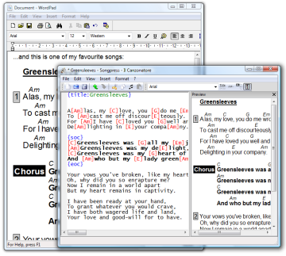

# Songpress - Il Canzonatore

Songpress is a free, easy to use song typeset program for Linux and Windows, that generates high-quality songbooks.

Songpress is focused on **song formatting**. Once your song is ready, you can paste it into your favorite document editor or pagination program, to give your songbook the look you like the most.

## Highlights

- Produce _high-quality guitar scores_ (text and chords)
- Easy to learn, quick to use
- You can paste _formatted songs into any Linux and Windows application_, to layout your songbook with maximum flexibility (Affinity, Microsoft Word, LibreOffice, Microsoft Publisher, Inkscape etc.)
- Export formatted songs to _SVG, PNG, HTML_ (web pages and snippets), _PPTX_ (karaoke)
- _Chord transposition_ with automatic key detection
- _Chord simplification_ for beginner guitarists: determine the easiest key to play your song, and transpose it automatically
- Support _several chord notations and conversion_: American (C, D, E), Italian (Do, Re, Mi), French, German and Portuguese
- Support _Chordpro_ and _Tab_ (i.e. two-line) chord formats
- _Clean up_ dirty songs with spurious blank lines (such as songs copied and pasted from web pages)

If you need help, or wish to discuss, please visit our [user support group](https://groups.google.com/g/songpress?pli=1).

## Installation

:material-download: [Download Songpress for Windows](https://github.com/lallulli/songpress/releases/download/1.9.0/songpress-net-setup.exe) 

For installation on Linux and more information, please, see [Getting Started](manual/getting_started.md) page.

## Songbook Samples

How does it look a songbook generated with Songpress? You can find some samples here.
If you clic on these images, you will be redirected to our Scout Gruop site, where you can download both the PDF of the songbooks and the original ChordPro files used to generate them.

[{hspace=30}](http://www.roma21.it/index.php?id=353)
[{hspace=30}](http://www.roma21.it/index.php?id=879)

## Source code

Songpress is released under the terms of an open source license: the [GNU General Public License version 2](https://www.gnu.org/licenses/old-licenses/gpl-2.0.en.html).

You can find more information on our project [GitHub repository](https://github.com/lallulli/songpress).

## Some history

We started the project in order to create a songbook for the Mass for our boy scout group (please [download the songbook](http://www.roma21.it/index.php?id=353) (in Italian) if you want to have a look at Songpress output). We quickly created the typesetting algorithm and the clipboard functionality.

In the introduction of the songbook there is a promise:

> In order to quiclky and accurately typeset our songbook, we created a piece of software.
> [...] Our intention is to improve it and distribute it for free (as an open source software) in our group website.

At the beginning we didn't have much time to improve the software into a complete application for non-geek users. Some times ago we decided to rewrite the program in Python (much more fun to program in than C++)... and the promise has been kept!

## Support the project

Songpress is hosted at GitHub and you can help in several ways:

- [reporting bugs](https://github.com/lallulli/songpress/issues)
- creating new translations
- providing artwork (icons, buttons etc.)
- contributing to the code (if you are a Python programmer)

## The ChordPro format

Songpress uses a subset of the [ChordPro format](https://www.chordpro.org/chordpro/chordpro-directives/).

It is very easy to use. Just write plain text (song lyrics), and...

- to insert the title, use the `{title:My Title}` or `{t:My Title}` command: `{title:God Save The Queen}`
- to insert a chord, place it in square brackets, just before the song syllable where the chord "starts": `[C]God save our [G]gracious queen`
- to break a verse, just leave an empty line
- to insert a chorus, wrap it inside `{soc}` or `{start_of_chorus}` and `{eoc}` or `{end_of_chorus}`: `{soc}Send her victorious [...]{eoc}`
- to insert a comment, use the `{comment:My Comment}` or `{c:My Comment}` command: `{c:Repeat twice}`
- any line that begins with a # does not generate any output

For further information, see the [Chordpro Manual page](manual/chordpro.md).