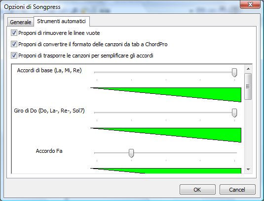

# Semplificazione degli accordi

La semplificazione degli accordi è una caratteristica, utile soprattutto per chitarristi principianti, che ti permetterà di suonare le canzoni usando la tonalità per te più facile, tenendo conto il tuo livello di abilità.

Per semplificare una canzone seleziona **Strumenti -> Semplifica gli accordi**. Songpress analizzerà la canzone (oppure la parte di canzone selezionata): se la tonalità corrente non è la più facile da suonare, Songpress ti mostrerà il livello di difficoltà attuale (da 0 a 5), ti suggerirà la tonalità più semplice con il relativo livello di difficoltà, e si offrirà di trasporre la canzone automaticamente. Premi **Sì** se vuoi procedere con la trasposizione.

Per far sì che Songpress possa tener conto del tuo livello di abilità gli devi indicare quali accordi preferisci. Seleziona **Strumenti -> Opzioni**; nella scheda Strumenti automatici troverai diversi gruppi di accordi, quali gli “Accordi di base” (La, Mi, Re), il giro di Do (Do, La-, Re-, Sol7), ecc. Per ciascun gruppo di accordi usa il cursore per impostare il tuo livello di abilità.

La semplificazione degli accordi può essere automatizzata. Attivando l’opzione **Proponi di trasporre le canzoni per semplificare gli accordi**, ogniqualvolta aprirai una canzone o incollerai una canzone in Songpress, se Songpress rileva che la canzone può essere semplificata te lo farà sapere, e si offrirà di effettuare la trasposizione.

