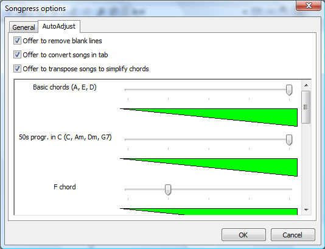

# Chord simplification

Chord simplification is a feature, especially useful for beginner guitarists, that allows you to play songs in the easiest key, according to your skill.
To simplify a song select **Tools -> Simplify chords**. Songpress will analyze your song (or your current selection): if the current key is not the easiest one, Songpress will show the current difficulty level (from 0 to 5), suggest the easiest key with its difficulty level, and offer to transpose the song automatically. Press **Yes** if you want to proceed with transposition.

In order to take your ability level into account, you should tell Songpress the chords you prefer. Select **Tools -> Options**; in the **AutoAdjust** tab you will see some chord groups, such as “Basic chords” (A, E, D), the 50’s progression in C (C, Am, Dm, G7), etc. For each chord group, adjust the slider to set up your ability level.

Chord simplification may take place automatically. By activating the option **Offer to transpose songs to simplify chords**, every time you open a song or you paste a song into Songpress, if Songpress detects that the song can be simplified, it will show a notification and offer to translate the song, as before.

