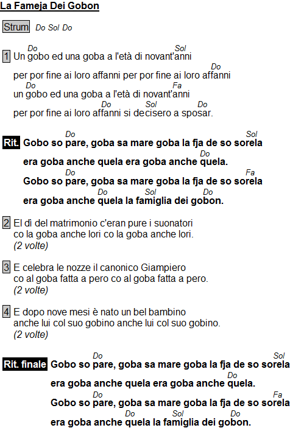

# Esempio

```
{title:La Fameja Dei Gobon}

{verse:Strum} [Do] [Sol] [Do]

Un [Do]gobo ed una goba a l'età di novant'[Sol]anni
per por fine ai loro affanni per por fine ai loro af[Do]fanni
un [Do]gobo ed una goba a l'età di novant'[Fa]anni
per por fine ai loro af[Do]fanni si de[Sol]cisero a spo[Do]sar.

{soc}
Gobo so [Do]pare, goba sa mare goba la fja de so so[Sol]rela
era goba anche quela era goba anche [Do]quela.
Gobo so [Do]pare, goba sa mare goba la fja de so so[Fa]rela
era goba anche [Do]quela la fa[Sol]miglia dei go[Do]bon.
{eoc}

El dì del matrimonio c'eran pure i suonatori
co la goba anche lori co la goba anche lori.
{c:2 volte}

E celebra le nozze il canonico Giampiero
co al goba fatta a pero co al goba fatta a pero.
{c:2 volte}

E dopo nove mesi è nato un bel bambino
anche lui col suo gobino anche lui col suo gobino.
{c:2 volte}

{soc:Rit. finale}
Gobo so [Do]pare, goba sa mare goba la fja de so so[Sol]rela
era goba anche quela era goba anche [Do]quela.
Gobo so [Do]pare, goba sa mare goba la fja de so so[Fa]rela
era goba anche [Do]quela la fa[Sol]miglia dei go[Do]bon.
{eoc}
```

E questo è il risultato:

