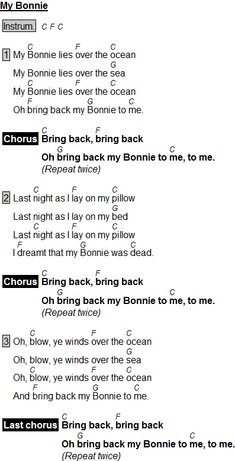

# Exemple

```
{title:My Bonnie}

{verse:Instrum.} [C] [F] [C]

My [C]Bonnie lies [F]over the [C]ocean
My Bonnie lies over the [G]sea
My [C]Bonnie lies [F]over the [C]ocean
Oh [F]bring back my [G]Bonnie to [C]me.

{soc}
[C]Bring back, [F]bring back
Oh [G]bring back my Bonnie to [C]me, to me.
{comment:Repeat twice}
{eoc}

Last [C]night as I [F]lay on my [C]pillow
Last night as I lay on my [G]bed
Last [C]night as I [F]lay on my [C]pillow
I [F]dreamt that my [G]Bonnie was [C]dead.

{soc}
[C]Bring back, [F]bring back
Oh [G]bring back my Bonnie to [C]me, to me.
{comment:Repeat twice}
{eoc}

Oh, [C]blow, ye winds [F]over the [C]ocean
Oh, blow, ye winds over the [G]sea
Oh, [C]blow, ye winds [F]over the [C]ocean
And [F]bring back my [G]Bonnie to [C]me.

{soc:Last chorus}
[C]Bring back, [F]bring back
Oh [G]bring back my Bonnie to [C]me, to me.
{comment:Repeat twice}
{eoc}
```

Will produce this:


